# earningtrader
A trading platform based on the Reinforcement Learning framework

(**Warning**) This project is under development, but not to be released and used yet. Currently, the architectural design and the executable functions barely outlines the initial idea of this library. Therefore, they are not yet stabilized at the moment. The architecture style, RL algorithms, and other performance features are intended to be added and continuously improved.

## Getting Started

### Prerequisites
This library assumes that:
- your Python version is equal to or above 3.9
- your operating system is either MacOS or Linux(We haven't tested Windows yet, but we will work on it in the near future)

### Installation
Install the project via `pip`(Currently we only serve [PyPI](https://pypi.org/)):

```sh
pip3 install earningtrader
```

### Hands-On Examples
(**Remark**) Note that the overall architectural design is premature; we will improve in the future updates.

Here is a list of examples:

- [Bernoulli Thompson Sampling Simulation](./docs/examples/bern_ts_simulation.ipynb)

## Project Overview

### Project Architecture
The image below depicts a general worflow of the entire system. However, this could vary depending on the algorithmic model or particular financial data you choose.



There are five main components in the project.
1. Data Acquisition: This component retrieves financial data from external API vendors. We have only implemented a fetcher using [yfinance](https://github.com/ranaroussi/yfinance) for demonstration.

2. Data Preprocessor: A preprocessor attempts to refine the retrieved data from a data acquisition component.

3. RL Algorithmic Model: A reinforcement learning algorithm must be implemented to integrate with the system. That is, you need to define
  - class
  - a collection of actions
  - reward

The goal of this library is to provide the state-of-the-art RL algorithms for various financial trades. However, we would like to provide you with the freedom to implement your own algorithms in future updates.

4. Trader: We need a component that handles actual trading using the external vendor APIs. This component is similar to the data acquisition part, but requires a more careful and sophisticated implementation(otherwise you will loose your money!).

5. Storage: The storage is for accumulating model data, such as parameters or historical rewards. Therefore, classical relational databases are not suitable for our purpose. Currently we only provide a very simple storage solution using the [shelve](https://docs.python.org/3/library/shelve.html) library.

On top of these essential components, we provide a temporary object called the "controller", which controlls the entire workflow of the system. However the actual usage of this component is little bit demanding for the clients; hence we will remove or modify this component for easier usage.

## License
This project is licensed under the terms of the MIT license.
